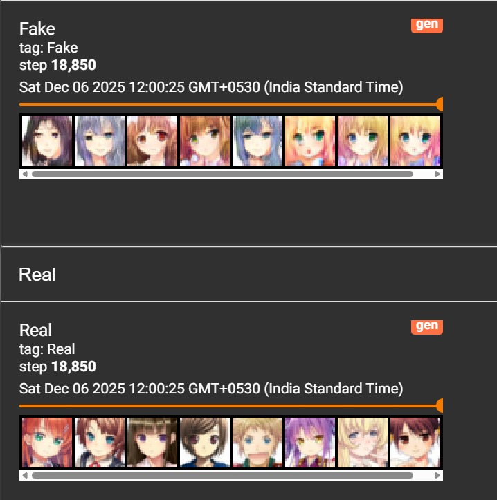

# Progressive GAN (ProGAN) from Scratch in PyTorch

Implementation of **Progressive Growing of GANs (ProGAN)** from scratch using PyTorch.

This project recreates the core ideas from the paper:

> Progressive Growing of GANs for Improved Quality, Stability, and Variation
> Tero Karras et al. (2017)

The model starts training on low-resolution images and progressively grows both the Generator and Discriminator to higher resolutions, leading to more stable GAN training and higher-quality image generation.

---

## Features

* Progressive Growing Training
* Fade-In Layers
* Equalized Learning Rate
* Pixel Normalization
* Minibatch Standard Deviation
* Generator & Discriminator implemented from scratch
* Pure PyTorch implementation

---

## Project Structure

```text
.
├── model.py
├── train.py
├── config.py
├── dataset.py
├── utils.py
└── README.md
```

---

## How ProGAN Works

Traditional GANs attempt to generate high-resolution images from the beginning of training.

ProGAN introduces a different strategy:

1. Start training at a very low resolution (e.g. 4×4)
2. Train Generator and Discriminator
3. Gradually add new layers
4. Increase resolution step by step

```text
4x4
 ↓
8x8
 ↓
16x16
 ↓
32x32
 ↓
64x64
 ↓
...
```

During each transition phase, newly added layers are smoothly blended using a fade-in mechanism.

This significantly improves training stability and image quality.

---

## Architecture

### Generator

```text
Latent Vector z
      ↓
    4×4
      ↓
    8×8
      ↓
   16×16
      ↓
   32×32
      ↓
   ...
```

### Discriminator

```text
Image
  ↓
High Resolution
  ↓
Low Resolution
  ↓
4×4 Features
  ↓
Real / Fake
```

---

## Training

```bash
python train.py
```

Adjust hyperparameters inside:

```bash
config.py
```

Examples:

* Image Resolution
* Batch Size
* Learning Rate
* Dataset Path
* Number of Epochs

---

## Results

### Generated Samples

Add generated images here.

```markdown

```

---

## References

* Progressive Growing of GANs (Karras et al., 2017)
* PyTorch Documentation

